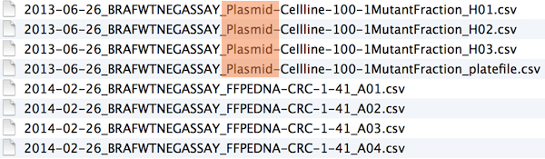

```{r setup, include=FALSE}
options(htmltools.dir.version = FALSE)
```

```{r xaringan-themer, include=FALSE, warning=FALSE}
library(xaringanthemer)
library(xaringanExtra)
library(tidyverse)
library(knitr)
library(nomnoml)
library(countdown)


xaringanExtra::use_logo(
  image_url = "https://raw.githubusercontent.com/rstudio/hex-stickers/master/PNG/xaringan.png"
)
xaringanExtra::use_panelset()
xaringanExtra::use_broadcast()
xaringanExtra::use_share_again()
xaringanExtra::style_share_again(share_buttons = c("twitter", "linkedin"))
xaringanExtra::use_tachyons()
xaringanExtra::use_fit_screen()
xaringanExtra::use_tile_view() # O
style_mono_accent(
  base_color = "#0dc96f",
  background_color = "#ffffff",
  inverse_background_color = "#3298cb",
  header_color = "#022044",
  inverse_header_color = "#ffffff", 
  inverse_text_color = "#ffffff",
  code_inline_color = "#179c55",
  link_color= "#0000FF",
  text_font_size = "25px",
  header_font_google = google_font("Poppins", "Regular", "400"),
  text_font_google   = google_font("Darker Grotesque", "500"),
  code_font_google   = google_font("Fira Mono"),
  )

```

```{r metathis, warning=FALSE, echo=FALSE}
# library(metathis)
# meta() %>%
#   meta_name("github-repo" = "flor14/rladies-jujuy") %>% 
#   meta_social(
#     title = "Meetup R-Ladies Jujuy",
#     description = paste(
#       "Mi próximo artículo científico con R:", 
#       "Compendios de Investigación, Reproducibilidad e",
#       "Interactividad en las publicaciones académicas"
#     ),
#     url = "https://flor14.github.io/rladies-jujuy/presentacion.html?panelset=licencia#1",
#     image = "https://res.cloudinary.com/flor/image/upload/v1608248822/jujuy-colores_frmvax.jpg",
#     image_alt = paste(
#       "Charla para el capítulo de R-Ladies de Jujuy, Argentina.",
#       "Diciembre de 2020"
#       ),
#     og_type = "website",
#     og_author = "Florencia D'Andrea",
#     twitter_card_type = "summary_large_image",
#     twitter_creator = "@cantoflor_87",
#     twitter_site = "@cantoflor_87"
#   )
```


class: middle, center

```{r hex, fig.align='center', echo = FALSE, out.width=150} 
    knitr::include_graphics("img/hex.png")
```


---


class: bottom

.bg-washed-blue.b--dark-blue.ba.bw2.br3.shadow-5.ph4.mt5[
### DSCI 521 - Lecture 7
### **SSH, filenames, and project organization**

 .large[#### Computing Platforms for Data Science - UBC MDS 2021/22
]]


---

## Lecture learning goals

1. Authenticate on GitHub using **SSH**.

--

2. **Name files** in a human and machine readable manner.

--

3. **Organize projects** with a meaningful folder hierarchy.

---

class: middle, inverse, center

## Set up keys for SSH for use with GitHub

---
class: middle, inverse

### To start, let's compare

#### Password-based authentication
#### SSH key-based authentication


---
### Password-based authentication

Passwords are short and tend to be somewhat easy to "break".

--
- Say your **password** contains 12 characters    

--
- Each character:  
  - 26 uppercase letters  
  - 26 lowercase letters  
  - 10 digits  
  - ~10 special characters    

--
- around ~70 possibilities per character, so $70^{12}\approx 10^{22}$    

--
- This is a **HUGE number** (except that there are patterns within passwords that make them easier to guess!)


.footnote[More on security and privacy in future courses]


---

### SSH key-based authentication 

**Secure SHell (SSH)**  a common method for **remote login** to another computer which is secure.

--

```{r cs, fig.align='center', echo = FALSE,out.width=400} 

```

--

- **server** a machine you are SSHing into.   


--

- **client** usually your machine.  
The client initiates contact with the server.


---

### SSH key-based authentication

**keys** (2 special files with longs strings of characters) in your computer.

--


.pull-left[

#### These files have an asymmetrical relationship:

1. **private key**   
CAN decrypt messages generated by the public key  
2. **public key**   
CANNOT decrypt messages generated by the private key 

.footnote[encryption is the process of encoding information]
]


--

.pull-right[

```{r pair, fig.align='center', echo = FALSE,out.width=200} 

```


]


.footnote[]


---

### Understanding public key / private key concepts

```{r 1ks, fig.align='center', echo = FALSE,out.width=350} 
knitr::include_graphics("img/keys.png")
```


**Public key (.pub)**

- A padlock that you can make copies of and put anywhere you want.

   
- Shared with services like GitHub


.footnote[[Checking for existing SSH keys](https://docs.github.com/en/enterprise-server@2.22/authentication/connecting-to-github-with-ssh/checking-for-existing-ssh-keys)]  
---

### Understanding public key / private key concepts

```{r 2ks, fig.align='center', echo = FALSE,out.width=350} 
knitr::include_graphics("img/keys.png")
```

 **Private key**

- Stored only on your computer

- It can open the padlock (public key) that is stored on the other machine.


---

### How the lock works

- Keys are generated using **ssh-keygen**, to make private key (`id_ed25519`) and a public key (`id_ed25519.pub`).

```{r lw, fig.align='center', echo = FALSE,out.width=400} 

```

---
### You can put your lock at many places
 You can make copies of `id_ed25519.pub` (public key/padlock) and distribute them to other machines
```{r ks2, fig.align='center', echo = FALSE,out.width=400} 
knitr::include_graphics("img/lock.png")
```


---

### How the lock works

```{r ks22, fig.align='center', echo = FALSE,out.width=500} 
knitr::include_graphics("img/congit.png")
```


---
### How the lock works

The Server uses the public key to encrypt a challenge message to you
```{r lock_works0, fig.align='center', echo = FALSE,out.width=455} 

```

---

### How the lock works


You need to show that you can decrypt the message to demonstrate that you are in possesion of the associated private key

```{r lock_works, fig.align='center', echo = FALSE,out.width=455} 

```
---

## Keeping your private key safe

#### **ssh-keygen** allows you to put a **password or passphrase** on the private key

##### 🚨⚠️ this should be shared with NO ONE! ⚠️🚨

- if your private key does fall into the wrong hands, the person must still know the password or passphrase to use the private key


---


## Why SSH keys over passwords
.pull-left[
```{r k1, fig.align='center', echo = FALSE,out.width=300} 

```
]
.pull-right[

* The private key is much longer than a password. 
* This makes it harder for a hacker to break (guess) the password. 
]

---


```{r ghtw, echo=FALSE, fig.align="center", message=FALSE, warning=FALSE, out.width=450}
library(tweetrmd)
tweet_screenshot("https://twitter.com/github/status/1425185352562663424?s=20")
```


.footnote[[Tweet](https://twitter.com/github/status/1425185352562663424?s=20)]


---

## Authentication vs. encryption

#### Authentication
- The system described above is purely for authentication
- The **client** needs to prove to the **server** that  it is authorized to access the server
- Someone with authority has put the public key in `~/.ssh/authorized_keys` on the server
- The server now grants access to anyone possessing a private key matching one of these public keys

--

#### **Encryption** of the data flowing between the client and server.
- Prevents eavesdroppers from listening to client-server communications


---

## GitHub

#### 1. [Creating a SSH key](https://docs.github.com/en/authentication/connecting-to-github-with-ssh/generating-a-new-ssh-key-and-adding-it-to-the-ssh-agent)

#### 2. [Adding your SSH key to the ssh-agent](https://docs.github.com/en/authentication/connecting-to-github-with-ssh/generating-a-new-ssh-key-and-adding-it-to-the-ssh-agent)


**ssh-agent** is a helper program that keeps track of user's identity keys and their passphrases. The agent can then use the keys to log into other servers without having the user type in a password or passphrase again. 

#### 3. [Adding a new SSH key to your GitHub account](https://docs.github.com/en/authentication/connecting-to-github-with-ssh/adding-a-new-ssh-key-to-your-github-account)

#### 4. [Testing your SSH connection](https://docs.github.com/en/authentication/connecting-to-github-with-ssh/testing-your-ssh-connection#)

.footnote[[ssh-agent / ssh.com](https://www.ssh.com/academy/ssh/agent)]


---


class: inverse, center, middle
# Filenames

### best practices

---

## What works, what doesn't?


myabstract.docx  
Joe’s Filenames Use Spaces and Punctuation.xlsx  
figure 1.png 
fig 2.png  
JW7d^(2sl@deletethisandyourcareerisoverWx2*.txt


--


2014-06-08_abstract-for-sla.docx    
joes-filenames-are-getting-better.xlsx    
fig01_talk-scatterplot-length-vs-interest.png    
fig02_talk-histogram-attendance.png    
1986-01-28_raw-data-from-challenger-o-rings.txt    


---

## What works, what doesn't?

#### NO

myabstract.docx  
Joe’s Filenames Use Spaces and Punctuation.xlsx  
figure 1.png 
fig 2.png  
JW7d^(2sl@deletethisandyourcareerisoverWx2*.txt


--

#### YES!

2014-06-08_abstract-for-sla.docx    
joes-filenames-are-getting-better.xlsx    
fig01_talk-scatterplot-length-vs-interest.png    
fig02_talk-histogram-attendance.png    
1986-01-28_raw-data-from-challenger-o-rings.txt    


---

## Three principles for (file) names

1. Machine readable

2. Human readable

3. Plays well with default ordering

---

## Awesome file names :)

```{r ks4, fig.align='center', echo = FALSE,out.width=700} 
knitr::include_graphics("img/awesome_names.png")
```

---

class: inverse, center, middle

## Machine Readable


---

## Machine Readable


.pull-left[
**Regular expression and [globbing](https://glosario.carpentries.org/en/#globbing) friendly**  

Avoid: 
- spaces
- punctuation
- accented characters
- case sensitivity (different files named `foo` and `Foo`)
  
**Easy to compute on**

 - Deliberate use of delimiters

]

.pull-right[

```{r robot, fig.align='center', echo = FALSE,out.width=700} 
knitr::include_graphics("img/rock-n-roll-monkey-FTfjMijq-Ws-unsplash.jpg")
```

]


---

class: middle 
### globbing
In Unix, the term “globbing” means “matching a set of files with a pattern”  
Could be consider a simplified form of regular expressions.   

--
Example: 
`*.dat` means “all files whose names end in `.dat`”.

```bash
ls *.dat

```
--
`*`(globbing) = `.*` (regex)

#### For this course we only will learn * (asterisk) for globbing

.footnote[[The Carpentries glosario](https://glosario.carpentries.org/en/#globbing)]
---

### Globbing
##### Excerpt of complete file listing:
```{r gb1, fig.align='center', echo = FALSE,out.width=700} 

```


---
### Globbing
##### Example of globbing to narrow file listing:


```{r ks85, fig.align='center', echo = FALSE,out.width=700} 
knitr::include_graphics("img/plasmid_glob.png")
```

---

### Recovery of meta-data from the filenames 

#### Deliberate use of **-** and **_** allows recovery of meta-data from the filenames:

 **_** (underscore) used to delimit units of meta-data I want later  
 **-** (hyphen) used to delimit words so my eyes don't bleed

```{r plasmid, fig.align='center', echo = FALSE,out.width=700} 
knitr::include_graphics("img/plasmid_delimiters.png")
```
---
class: inverse, middle
### Recap: machine readable
 Easy to search for files later

 Easy to narrow file lists based on names

 Easy to extract info from file names, e.g. by splitting


---

## Human readable


.pull-left[
Name contains info on content

Connects to concept of a slug from semantic URLs

]

.pull-right[
```{r human, fig.align='center', echo = FALSE,out.width=500} 
knitr::include_graphics("img/sincerely-media-c1YrcFYW66s-unsplash.jpg")
```

]

---
###Which set of file(name)s do you want at 3 a.m. before a deadline?

```{r ks5, fig.align='center', echo = FALSE,out.width=700} 
knitr::include_graphics("img/human_readable_not_options.png")
```
---

### Embrace the slug

Some systems define a **slug** as the part of a URL that identifies a page in human-readable keywords.

**Semantic URLs** 
Use words with inherent meaning that can be understood by anyone, regardless of their technical know-how

.footnote[[Mozilla - What is an URL?](https://developer.mozilla.org/en-US/docs/Learn/Common_questions/What_is_a_URL)]
---

class: inverse, middle

## Recap: Human readable
Easy to figure out what something is, based on its name


---

## Plays well with default ordering
.pull-left[- Put something numeric first
- Use the [ISO 8601](https://www.iso.org/iso-8601-date-and-time-format.html) standard for dates
- Left pad other numbers with zeros]
.pull-right[

```{r order, fig.align='center', echo = FALSE,out.width=700} 

```

]


---

## Examples
Chronological order:

```{r co, fig.align='center', echo = FALSE,out.width=700} 
knitr::include_graphics("img/chronological_order.png")
```

---

logical order:

```{r lo, fig.align='center', echo = FALSE,out.width=700} 
knitr::include_graphics("img/logical_order.png")
```


---

## Dates
Use the ISO 8601 standard for dates: YYYY-MM-DD

```{r do, fig.align='center', echo = FALSE,out.width=700} 
knitr::include_graphics("img/dates_order.png")
```


.footnote[[ISO 8601](https://www.iso.org/iso-8601-date-and-time-format.html)]

---

### Left pad other numbers with zeros


If you don’t left pad, you get this:
```
10_final-figs-for-publication.R
1_data-cleaning.R
2_fit-model.R
```
which is just sad **:(**
--

```
01_data-cleaning.R
02_fit-model.R
10_final-figs-for-publication.R
```

Better **:)**
---

class: inverse, middle

### Recap: Plays well with default ordering
 Put something numeric first

 Use the ISO 8601 standard for dates

 Left pad other numbers with zeros

---

### Recap: Three principles for (file) names
- Machine readable

- Human readable

- Plays well with default ordering

---

class: inverse, center, middle

## .gitignore

---

### Tell Git to ignore irrelevant files using a .gitignore file

You may have encountered this before:

```bash
git status
On branch timberst-master
Untracked files:
  (use "git add <file>..." to include in what will be committed)

    .ipynb_checkpoints/
    
no changes added to commit (use "git add" and/or "git commit -a")
```

Git is letting us know about untracked files (ones we have never committed before). We don't care about these files.  What do we do?

---

### Create a .gitignore file

Create a file called `.gitignore` inside your Git repo. To do this with VS Code, I would type:

```bash
code .gitignore
```
Inside the text file, list the files and folders you would like to ignore, one per line. For example:

```bash
.ipynb_checkpoints/
```
Save the file, and add and commit it with Git. 


.footnote[[.gitignore](https://carpentries-incubator.github.io/git-Rstudio-course/02-ignore/index.html)]
  
---

### .gitignore tips and tricks

- append `**/ `to the beginning of any file/folder names listed in the `.gitignore` file to have them ignored in subdirectories within the repo as well  

--

- create a global `.gitignore` file so that you do not have to create the same .gitignore for all your homework repos
  
  
.footnote[[gitignore - Git Documentation]([gitignore - Carpentries Incubator](xhttps://carpentries-incubator.github.io/git-Rstudio-course/02-ignore/index.htmlhttps://carpentries-incubator.github.io/git-Rstudio-course/02-ignore/index.html)]  
---
class: center, middle, inverse

## Project Organization


---

### Project organization

A good project structure looks similar to this:

```bash
project/          
├── data/              *.csv        
│   ├── processed/
│   └── raw/     
├── reports/           *.ipynb *.Rmd
├── src/               *.py *.R
├── doc/               *.md
├── README.md
└── environment.yaml (or renv.lock)
```

- **Raw data** If you do not save it, you can’t go back to the start of an analysis

- You can have a **README.md** file inside each folder

.footnote[[Raw Data - DataCarpentries Incubator](https://carpentries-incubator.github.io/life-sciences-workshop/04-data-management-raw-data/index.html)]


---

### Project organization

A good project structure looks similar to this:  

```bash
project/          
├── data/              *.csv        
│   ├── processed/
│   └── raw/     
├── reports/           *.ipynb *.Rmd
├── src/               *.py *.R
├── doc/               *.md
├── README.md
└── environment.yaml (or renv.lock)
```

**scr** can differ slightly between projects 

- R the src directory is often just called R/
- whereas for Python is has the same name as the project (project). 

**environment file.yaml (or renv.lock)**
Environments


---
## References

.bg-washed-blue.b--dark-blue.ba.bw2.br3.shadow-5.ph4.mt5[

[Creating a SSH key - GitHub Docs](https://docs.github.com/en/authentication/connecting-to-github-with-ssh/generating-a-new-ssh-key-and-adding-it-to-the-ssh-agent)
 
[Collection of useful gitgnore patterns](https://github.com/github/gitignore)
 
[gitignore - Carpentries Incubator](xhttps://carpentries-incubator.github.io/git-Rstudio-course/02-ignore/index.htmlhttps://carpentries-incubator.github.io/git-Rstudio-course/02-ignore/index.html)

[gitignore - Git Documentation]([gitignore - Carpentries Incubator](xhttps://carpentries-incubator.github.io/git-Rstudio-course/02-ignore/index.htmlhttps://carpentries-incubator.github.io/git-Rstudio-course/02-ignore/index.html)
 
[HTTPS vs SSH in git - Blog OurTechRoom](https://ourtechroom.com/tech/https-vs-ssh-in-git/)

[ISO 8601 standar for dates](https://www.iso.org/iso-8601-date-and-time-format.html)
 

]


---


class: inverse, middle, center


## Thank you!
