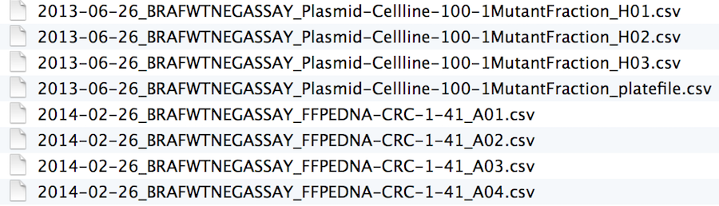
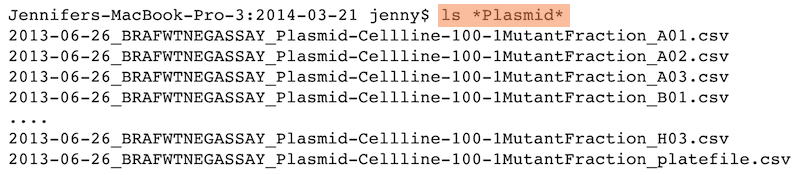

```{r setup, include=FALSE}
options(htmltools.dir.version = FALSE)
```

```{r xaringan-themer, include=FALSE, warning=FALSE}
library(xaringanthemer)
library(xaringanExtra)
library(tidyverse)
library(knitr)
library(nomnoml)
library(countdown)
xaringanExtra::use_logo(
  image_url = "https://raw.githubusercontent.com/rstudio/hex-stickers/master/PNG/xaringan.png"
)
xaringanExtra::use_panelset()
xaringanExtra::use_broadcast()
xaringanExtra::use_share_again()
xaringanExtra::style_share_again(share_buttons = c("twitter", "linkedin"))
xaringanExtra::use_tachyons()
xaringanExtra::use_fit_screen()
xaringanExtra::use_tile_view() # O
style_mono_accent(
  base_color = "#0dc96f",
  background_color = "#ffffff",
  inverse_background_color = "#3298cb",
  header_color = "#022044",
  inverse_header_color = "#ffffff", 
  inverse_text_color = "#ffffff",
  code_inline_color = "#179c55",
  link_color= "#0000FF",
  text_font_size = "25px",
  header_font_google = google_font("Poppins", "Regular", "400"),
  text_font_google   = google_font("Darker Grotesque", "500"),
  code_font_google   = google_font("Fira Mono"),
  )

```

```{r metathis, warning=FALSE, echo=FALSE}
# library(metathis)
# meta() %>%
#   meta_name("github-repo" = "flor14/rladies-jujuy") %>% 
#   meta_social(
#     title = "Meetup R-Ladies Jujuy",
#     description = paste(
#       "Mi próximo artículo científico con R:", 
#       "Compendios de Investigación, Reproducibilidad e",
#       "Interactividad en las publicaciones académicas"
#     ),
#     url = "https://flor14.github.io/rladies-jujuy/presentacion.html?panelset=licencia#1",
#     image = "https://res.cloudinary.com/flor/image/upload/v1608248822/jujuy-colores_frmvax.jpg",
#     image_alt = paste(
#       "Charla para el capítulo de R-Ladies de Jujuy, Argentina.",
#       "Diciembre de 2020"
#       ),
#     og_type = "website",
#     og_author = "Florencia D'Andrea",
#     twitter_card_type = "summary_large_image",
#     twitter_creator = "@cantoflor_87",
#     twitter_site = "@cantoflor_87"
#   )
```


class: middle, center

```{r hex, fig.align='center', echo = FALSE, out.width=150} 
    knitr::include_graphics("img/hex.png")
```


---


class: bottom

.bg-washed-blue.b--dark-blue.ba.bw2.br3.shadow-5.ph4.mt5[
### DSCI 521 - Lecture 7
### **SSH, filenames, and project organization**

 .large[#### Computing Platforms for Data Science - UBC MDS 2021/22
]]


---

## Lecture learning goals

1. Authenticate on GitHub using SSH.

--

2. Name files in a human and machine readable manner.

--

3. Organize projects with a meaningful folder hierarchy.
---

class: middle, inverse

## Set up keys for SSH for use with GitHub


---

## Remotely accessing another computer using SSH
Let's start with some definitions:


**Secure SHell (SSH)**  a common method for remote login to another computer which is secure.

--

**server** - a machine you are SSHing into. The server sits and waits to be contacted.

--

**client** - usually your machine. The client initiates contact with the server.


---

## Review - password-based authentication
Passwords are short and tend to be somewhat easy to "break" (guess).
- Say your password contains 12 characters
- each character is one of 26 uppercase letters, 26 lowercase letters, 10 digits, or ~10 special characters
- total probably around ~70 possibilities per character, so $70^{12}\approx 10^{22}$
- This is a HUGE number, except that there are patterns within passwords that make them easier to guess
More on security and privacy in future courses

---

## SSH key-based authentication
Two components:

1. public key
2. private key


--

These files have an asymmetrical relationship:

- the **public key** CANNOT decrypt messages generated by the private key
- the **private key** CAN decrypt messages generated by the public key

---

## Understanding public key private key concepts

--

- **Public key**

   - A padlock that you can make copies of and put anywhere you want.

   - To put your ‘padlock’ on an another machine, you would copy it to authorized_keys in the `~/.ssh` folder.

--

- **Private key**

It can open the padlock that is stored on the other machine.


```{r ks, fig.align='center', echo = FALSE,out.width=500} 

```
---


## How the lock works

- Keys are generated using `ssh-keygen`, to make:
  - private key (usually called `id_rsa`) 
  - public key (usually called `id_rsa.pub`)
  
- You can make copies of `id_rsa.pub` (public key/padlock) and distribute them to other machines
- The other machine uses the public key to encrypt a challenge message to you
- You need to show that you can decrypt the message to demonstrate that you are in possesion of the associated private key

---
## You can put your lock at many places
As long as you are using the same lock (public key), you will be able to open it with the same private key.

```{r ks2, fig.align='center', echo = FALSE,out.width=700} 

```


.footnote[source: http://blakesmith.me/2010/02/08/understanding-public-key-private-key-concepts.html]
---

## Keeping your private key safe
ssh-keygen allows you to put a password or passphrase on the private key
this should be shared with NO ONE!
if your private key does fall into the wrong hands, the person must still know the password or passphrase to use the private key

```{r ks3, fig.align='center', echo = FALSE,out.width=700} 
knitr::include_graphics("img/password_strength.png")
```


.footnote[source - https://xkcd.com/936/]


---


## Why SSH keys over passwords
SSH keys use the RSA cryptosystem

The private key is much longer than a password. A standard now is 4096-bit keys, which means $&gt; 10^{1200}$ possibilities. 
This makes it harder for a hacker to break (guess) the password. More on this when we discuss binary numbers next week.

Aside: Quantum computers will be able to break RSA encryption. It is very hard to predict whether this is years or decades away.

---

## Authentication vs. encryption
The system described above is purely for authentication

The client needs to prove to the server that the client is authorized to access the server
Someone with authority has put the public key in `~/.ssh/authorized_keys` on the server
---

## Authentication vs. encryption
The server now grants access to anyone possessing a private key matching one of these public keys
This is separate from encryption of the data flowing between the client and server.

This prevents eavesdroppers from listening to client-server communications

---


class: inverse, center, middle
# Filenames

### best practices

---

## What works, what doesn't?

.bg-washed-blue.b--dark-blue.ba.bw2.br3.shadow-5.ph4.mt5[
myabstract.docx  
Joe’s Filenames Use Spaces and Punctuation.xlsx  
figure 1.png 
fig 2.png  
JW7d^(2sl@deletethisandyourcareerisoverWx2*.txt
]

--

.bg-washed-blue.b--dark-blue.ba.bw2.br3.shadow-5.ph4.mt5[
2014-06-08_abstract-for-sla.docx    
joes-filenames-are-getting-better.xlsx    
fig01_talk-scatterplot-length-vs-interest.png    
fig02_talk-histogram-attendance.png    
1986-01-28_raw-data-from-challenger-o-rings.txt    
]

---

## What works, what doesn't?


.bg-washed-blue.b--dark-blue.ba.bw2.br3.shadow-5.ph4.mt5[
myabstract.docx  
Joe’s Filenames Use Spaces and Punctuation.xlsx  
figure 1.png 
fig 2.png  
JW7d^(2sl@deletethisandyourcareerisoverWx2*.txt
]

--


.bg-washed-blue.b--dark-blue.ba.bw2.br3.shadow-5.ph4.mt5[
2014-06-08_abstract-for-sla.docx    
joes-filenames-are-getting-better.xlsx    
fig01_talk-scatterplot-length-vs-interest.png    
fig02_talk-histogram-attendance.png    
1986-01-28_raw-data-from-challenger-o-rings.txt    
]

---

## Three principles for (file) names

- Machine readable

- Human readable

- Plays well with default ordering

---

## Awesome file names :)

```{r ks4, fig.align='center', echo = FALSE,out.width=700} 

```

---

class: inverse, center, middle

## Machine Readable


---

## Machine Readable

- Regular expression and [globbing](https://glosario.carpentries.org/en/#globbing) friendly
  - Avoid spaces, punctuation, accented characters, case sensitivity
--

- Easy to compute on

 - Deliberate use of delimiters


globbing: To specify a set of filenames using a simplified form of 
regular expressions, such as *.dat to mean “all files whose names end in .dat”.
The name is derived from “global”.

---


## Example of globbing to narrow file listing:


```{r ks5, fig.align='center', echo = FALSE,out.width=700} 

```

---

Same using Mac OS Finder search facilities
Same using regex in R
Punctuation {.smaller}
Deliberate use of "-" and "_" allows recovery of meta-data from the filenames:

"_" underscore used to delimit units of meta-data I want later
"-" hyphen used to delimit words so my eyes don't bleed


---

### Recap: machine readable
- Easy to search for files later

- Easy to narrow file lists based on names

- Easy to extract info from file names, e.g. by splitting

---

##### New to regular expressions and globbing? be kind to yourself and avoid

- Spaces in file names
- Punctuation
- Accented characters
- Different files named foo and Foo

---

## Human readable
Name contains info on content

Connects to concept of a slug from semantic URLs


##### Example
Which set of file(name)s do you want at 3 a.m. before a deadline?
Examples
Chronological order:


---

###Embrace the slug
slug filenames  slug 


Semantic URLs use words with inherent meaning that can be understood by anyone, regardless of their technical know-how

.footnote[https://developer.mozilla.org/en-US/docs/Learn/Common_questions/What_is_a_URL]
---

class: inverse, middle

####Recap: Human readable
Easy to figure out what the heck something is, based on its name


---

## Plays well with default ordering


- Put something numeric first
- Use the [ISO 8601](https://www.iso.org/iso-8601-date-and-time-format.html) standard for dates
- Left pad other numbers with zeros

---

## Examples
Chronological order:

```{r co, fig.align='center', echo = FALSE,out.width=700} 
knitr::include_graphics("img/chronological_order.png")
```

---

logical order:

```{r lo, fig.align='center', echo = FALSE,out.width=700} 
knitr::include_graphics("img/logical_order.png")
```


---

## Dates
Use the ISO 8601 standard for dates: YYYY-MM-DD

```{r do, fig.align='center', echo = FALSE,out.width=700} 
knitr::include_graphics("img/dates_order.png")
```


.footnote[[ISO 8601](https://www.iso.org/iso-8601-date-and-time-format.html)]
---

## Comprehensive map of all countries in the world that use the MM-DD-YYYY format


From https://twitter.com/donohoe/status/597876118688026624.


---

### Left pad other numbers with zeros


If you don’t left pad, you get this:
```
10_final-figs-for-publication.R
1_data-cleaning.R
2_fit-model.R
```
which is just sad :(


---

### Recap: Plays well with default ordering
- Put something numeric first

- Use the ISO 8601 standard for dates

- Left pad other numbers with zeros

---

### Recap: Three principles for (file) names
- Machine readable

- Human readable

- Plays well with default ordering

---
class: inverse, center, middle

## .gitignore

---

## Tell Git to ignore irrelevant files using a .gitignore file

You may have encountered this before:

```
git status
On branch timberst-master
Untracked files:
  (use "git add <file>..." to include in what will be committed)

    .ipynb_checkpoints/
    .DS_Store

no changes added to commit (use "git add" and/or "git commit -a")
```

Git is letting us know about untracked files (ones we have never committed before). We don't care about these files. We'd prefer not to have them clutter our view (so we can pay attention to files we do want to track). What do we do?

---

### Create a .gitignore file
Using the plain text editor of your choice (mine is VS Code) create a file called .gitignore inside your Git repo. To do this with VS Code, I would type:
```
code .gitignore
```
Inside the text file, list the files and folders you would like to ignore, one per line. For example:
```
.ipynb_checkpoints/
.DS_Store
```
Save the file, and add and commit it with Git. Then try git status again. You should see:
```
On branch timberst-master
nothing to commit, working tree clean
```

---


### .gitignore tips and tricks
append **/ to the beginning of any file/folder names listed in the .gitignore file to have them ignored in subdirectories within the repo as well
create a global `.gitignore` file so that you do not have to create the same .gitignore for all your homework repos
Let's create a gitignore file in our 521 lab 2 repo.

#### Steps to follow:
1. Use a text editor (e.g., VS Code, nano, Jupyter) to create a file called .gitignore in your 521 lab 2 repo
2. Add `**/.ipynb_checkpoints/` to that file and save it
3. `add` and `commit` `it with Git
4. Type `git status` and see if you no longer see `.ipynb_checkpoints/` as a untracked file

---

### Project organization¶
A good project structure looks similar to this:
```
project/          
├── data/              *.csv        
│   ├── processed/
│   └── raw/     
├── reports/           *.ipynb *.Rmd
├── src/               *.py *.R
├── doc/               *.md
├── README.md
└── environment.yaml (or renv.lock)
```
This can differ slightly between projects and for R the src directory is often just called R/, whereas for Python is has the same name as the project (project). You will learn more about project hierarchy when making packages.


---

## References

.bg-washed-blue.b--dark-blue.ba.bw2.br3.shadow-5.ph4.mt5[

 [Collection of useful gitgnore patterns](https://github.com/github/gitignore)
 
 [ISO 8601 standar for dates](https://www.iso.org/iso-8601-date-and-time-format.html)
 
 [GitHub repo `xaringan` package](https://github.com/yihui/xaringan)
 
 [GitHub repo `xaringanthemer` package](https://pkg.garrickadenbuie.com/xaringanthemer/)

 [R Markdown documents](https://rmarkdown.rstudio.com/)

 [R Markdown: The Definitive Guide](https://bookdown.org/yihui/rmarkdown/)
 
 [RStudio oficial - Distill for RMarkdown](https://rstudio.github.io/distill)


]


---


class: inverse, middle, center


## Thank you!
